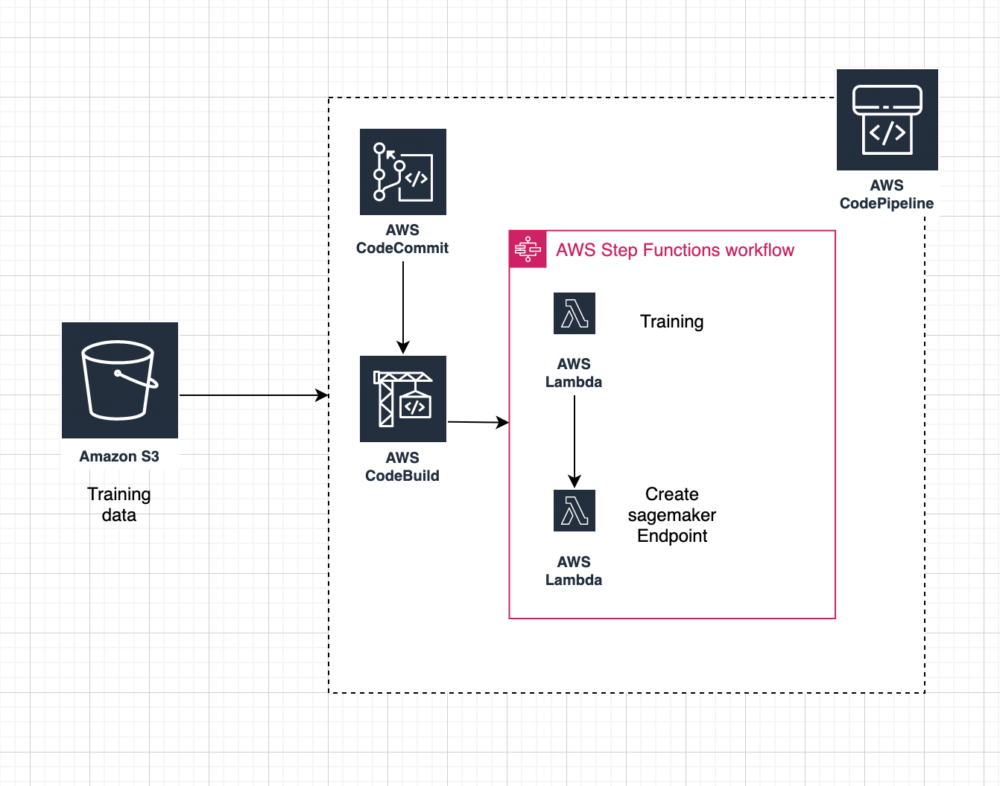

# Welcome to project!

This is a MLOps project for Python development with CDK.

The code would be avaiable in Github (https://github.com/Eva0926/DevOps-AoD)
To clone the repo here: https://github.com/Eva0926/DevOps-AoD.git

Prerequisites:
please make sure if you installed the followings:
1. AWS CLI [Getting started with the AWS CLI](https://docs.aws.amazon.com/cli/latest/userguide/cli-chap-getting-started.html)\
2. AWS Account and User:
Open a terminal window and use aws configure to set up your environment. Type the access key ID and secret key and choose a default region (you can use us-east-1, eu-west-1, us-west-2 for example).
```Python
aws configure
AWS Access Key ID [None]: <type key ID here>
AWS Secret Access Key [None]: <type access key>
Default region name [None]: <choose region (e.g. "us-east-1", "eu-west-1")>
Default output format [None]: <leave blank>
```

3. IDE ([VSCode](https://code.visualstudio.com/) recommended)
4. AWS CDK Toolkit 
`npm install -g aws-cdk`
5. Python([Python](https://www.python.org/downloads/))


## CDK Stacks
There are 2 stacks:
1. pipeline-stack\
Create following resources:\
a. ECR Repository\
`{ACCOUNT_ID}ecr-repo`: ecr repository to push docker container into\
b. data, code and model s3 buckets\
`{construct_id}-pipeline-bucket`: code bucket\
`{construct_id}-model-bucket`: model bucket\
`{construct_id}-data-bucket`: data bucket\
c. code_pipeline\
`pipeline-stack-PipelineStack`: code pipeline with 3 stages: Source, Build, Deploy\
d. step function\
`StateMachine` : stepfunction with 4 stages: TrainingJob, CreateModel, CreateEndpointconfig, CreateEndpoint\
e. endpoint_config\
`pipeline-stack-endpoint-config`\
f. endpoint\
`pipeline-stack-endpoint`

2. sagemaker-stack\
Create following resources:\
a. sagemaker execution role\
`sagemaker-stack-CDKSageMakerExecutionRole`\
b. CodeCommit repository\
`sagemaker-stack-CDKDefaultRepository`: it stores the code for the model\
c. SageMaker Notebook\
`sagemaker-stack-CDKNotebookInstance`

## Architecture 


## Directory Files
**DEVOPS-AOD** - Directory containing all code associated with the project. 
- **README.md** - Markdown readme file (i.e. this file).  
- **aod_workshop** - Containing all code associated with the stacks.\
​      \* **pipeline.py**  - Code for pipeline stack\
​      \* **sagemaker_stack.py** - Code for sagemaker stack\
​      \* **step_function_stack.py**  - Code for step function stack
- **requirements.txt** - Packages required.
- **sagemaker-code** - The code and traning data for the model.\
      \* **data** - The data for training\
      \* **model-code** - The code for the model building
- **architeture.png** - The architecture diagram

## Deployment Instructions
To manually create a virtualenv on MacOS and Linux:

```
$ python3 -m venv .venv
```

After the init process completes and the virtualenv is created, you can use the following
step to activate your virtualenv.

```
$ source .venv/bin/activate
```

If you are a Windows platform, you would activate the virtualenv like this:

```
% .venv\Scripts\activate.bat
```

Once the virtualenv is activated, you can install the required dependencies.

```
$ pip install -r requirements.txt
```

It’s always a good practice to run this and check if there is any error before you deploy your cdk app.

```
$ cdk synth
```
Deploy the sagemaker stack
```
$ cdk deploy sagemaker-stack
```
After deploy the sagemaker stack, you will create a repo in the CodeCommit, and also create a sagemaker notebook in the sagemaker. A sample working code is present in the sagemaker-code file. you need to put the code in the sagemaker notebook, make sure the folder (staging) is in home directory (`SageMaker/{your-repo-name}`), and push the changes to the repo in CodeCommit.

Deploy the pipeline stack
```
$ cdk deploy pipeline-stack
```
It will create the CodePipeline with a Source, Build and Deploy stages. Before deploy stage, make sure you have training data (sagemaker-code/staging/data/train/iris.csv) in the s3 bucket {data_bucket}/input.

The stack is complete, and any changes you make to your code will trigger the pipeline and train/deploy a new model!

## Note
- The the Step Functions training job need to use a unique job name for each run. You may encounter the error:
```
Training job names must be unique within an AWS account and region, and a training job with this name already exists
```
 So if you want to rerun the traning job again, please update line 90 and 104, from `-training-job` with a new traning job name.
